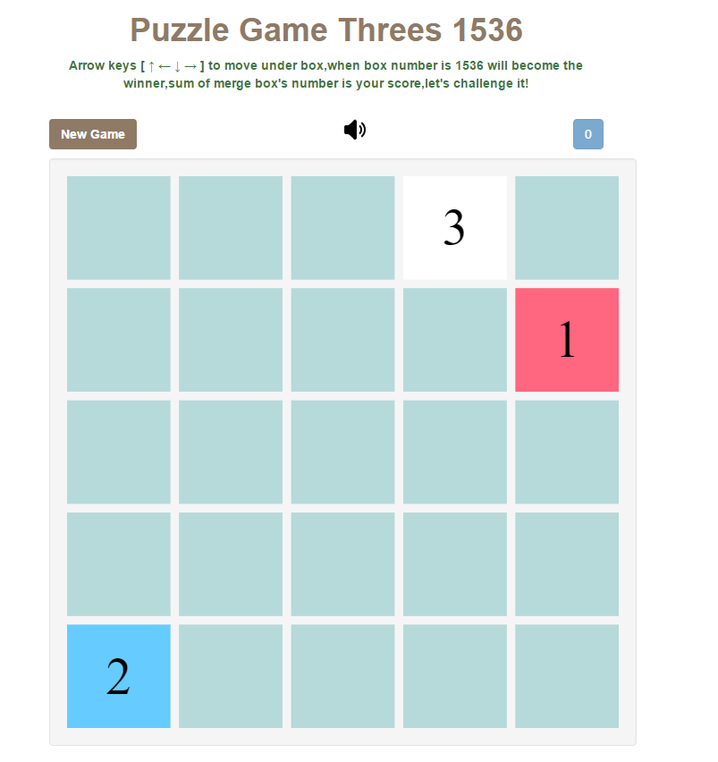

# puzzle-game-threes1536 #

This project use canvas 2d to draw the box of number and responsive web design by bootstrap's grid system.

Demo for html5 canvas basic usage.

## Demo ##

<a href="https://weihanchen.github.io/puzzle-game-threes1536/" target="_blank">demo page</a>

## Run examples with server ##
* bower install
* npm install 
* npm run gulp
* node run.js
* default port 8000

## Dependencies ##
* [bootstrap](http://getbootstrap.com/) - responsive ui framework
* [sweetalert](http://t4t5.github.io/sweetalert/) - show messages

## Screenshot ##

## Algorithm Flow ##

1. initial metrics

    `generate array[col * row] and give random 0 ~ col * row -1`
    
2. reset canvas width and height

    `according parent container to resize width and height`
    
3. add key event listener

    `arrow keys [ ↑ ← ↓  → ] `

	* metrics on [↑]
		* when value[row][col] === empty,then value[row][col] = value[row + 1][col].
		* when value[row + 1][col] === empty,then continue.
		* when value[row][col] + value [row + 1][col] === 3 || 3 * n,then value[row][col] = value[row + 1][col],value[row + 1][col] = empty.
	* metrics down [↓]
		* when value[row][col] === empty,then value[row][col] = value[row - 1][col].
		* when value[row - 1][col] === empty,then continue.
		* when value[row][col] + value[row - 1][col] === 3 || 3 * n,then value[row][col] = value[row - 1][col],value[row - 1][col] = empty.
	* metrics left [←]
		* when value[row][col] === empty,then value[row][col] = value[row][col + 1].
		* when value[row][col + 1] === empty,then contnue.
		* when value[row][col] + value[row][col + 1] === 3 || 3 * n,then value[row][col] = value[row][col + 1],value[row][col + 1] = empty.
	* metrics right [→]
		* when value[row][col] === empty,then value[row][col] = value[row][col - 1].
		* when value[row][col - 1] === empty,then continue.
		* when value[row][col] + value[row][col - 1] === 3 || 3 * n,then value[row][col] = value[row][col - 1],value[row][col - 1] = empty.
4. record merged number 

    `value[row][col]`
    
5. when moved and merged success then add new number 
 
    `value[row][col] = generateNewNumber()`

6. check winner or loser
	* winner 
	
	    `metrics array contains number of 1536`

	* loser
	
	    `metrics array have no space to add new number.`

## To Do ##
* add firebase to record user's score
* adjust new number